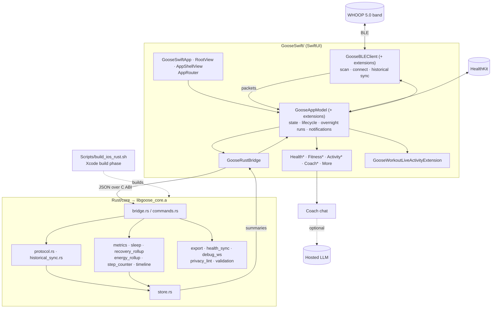

# Architecture

A SwiftUI iOS app for WHOOP 5.0 data. BLE and UI live in Swift; parsing, storage and metrics run in a Rust core compiled to a static library and called through a JSON-over-C bridge.

